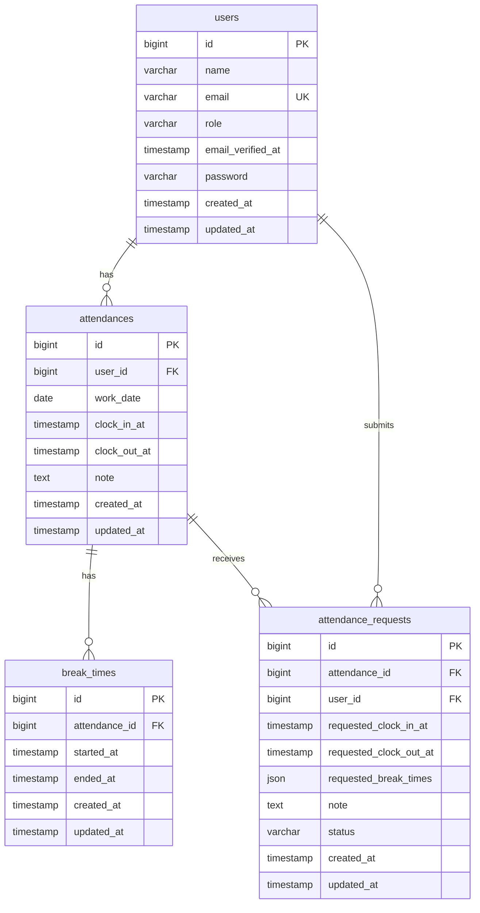

# ER図

## 補足

- `users` と `attendances` は `1:N`
- `attendances` と `break_times` は `1:N`
- `users` と `attendance_requests` は `1:N`
- `attendances` と `attendance_requests` は `1:N`
- `attendances` は `user_id + work_date` の複合ユニーク制約を持ち、1ユーザー1日1勤怠です
